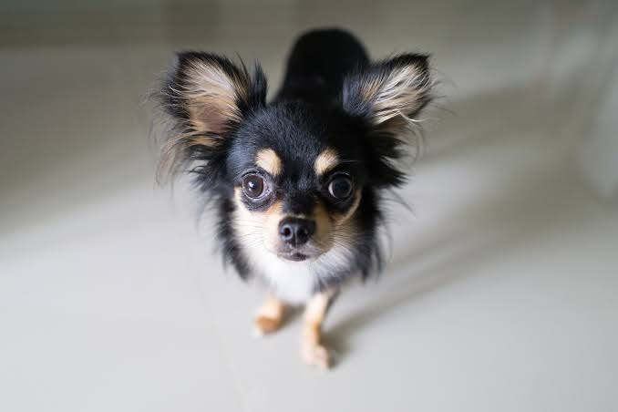
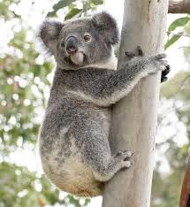

# Adversarial Attack Implementation: FGSM and PGD with VGG16

Here, we use two different algorithms, FGSM(Fast Gradient Sign Method) and PGD(Projected Gradient Descent) to create images, that are identical to the input for the human eye but, fools the image classification models into misclassifying the image as something else.
These algorithms work on almost all image classification model, but in my project I have used the VGG16 classifier as an example.
The attacks can be targeted(Misclassify the input image to a specified target label) or untargeted ( Misclassify the input image to any label other than its original label). The algorithm for both attacks remains the same, but the definition of the loss function changes based on the attack.

## FGSM(Fast Gradient Sign Method)

This method was introduced by Goodfellow et.al. This algorithm generates the adversarial image in a single step making it highly efficient and is used extensively to create adversarial examples to train robust classifiers.
This algorithm works by calculating the cross-entropy loss of the image classifier and using gradient descent to modify the image to increase the loss further (in case of untargeted attacks). In targeted attacks, this algorithm aims to improve the probability of the target variable.
Each pixel of the image is only modified by a small value($\epsilon$) so the changes are imperceptible to the human eye.

<table>
  <tr>
    <td align="center">
       
      Input image(Treeing Walker Coonhound)
    </td>
    <td align="center">
       
      Generated FGSM petrubation
    </td>
     <td align="center">
       
      Image with petrubation applied(classified as Chihuahua)
    </td>
    <td align="center">
       
      Actual image of a Chihuahua
    </td>
  </tr>
  <tr>
     <td align="center">
       
      Input image(Magpi)
    </td>
    <td align="center">
       
      Generated FGSM petrubation
    </td>
     <td align="center">
       
      Image with petrubation applied(classified as Crayfish)
    </td>
    <td align="center">
       
      Actual image of a Crayfish
    </td>
  </tr>
</table>

## PGF(Projected Gradient Descent)

This algorithm was introduced by Simon Geisler et.al and is built of top of FGSM. It is an iterative algorithm, that tries to find the smallest change to bring about misclassification.
This method produces better quality images and has a higher success rate for targeted misclassification when compared to FGSM,but it has higher compute requirements when compared to FGMS due to its iterative nature.

### The images generated below are generated using PGD, with the target set. Hyperparameters: 500 epochs and learning rate: 0.001

<table>
  <tr>
    <td align="center">
       
      Input image(Treeing Walker Coonhound)
    </td>
     <td align="center">
       
      Image with petrubation applied(classified as wippet,target was wippet)
    </td>
    <td align="center">
       
      Actual image of a wippet
    </td>
  </tr>
  <tr>
     <td align="center">
       
      Input image(Magpi)
    </td>
     <td align="center">
       
      Image with petrubation applied(classified as koala, target was koala)
    </td>
    <td align="center">
       
      Actual image of a koala
    </td>
  </tr>
</table>